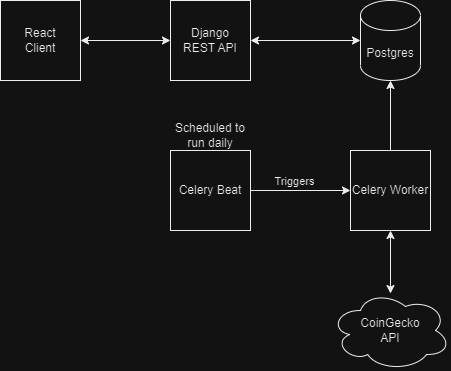
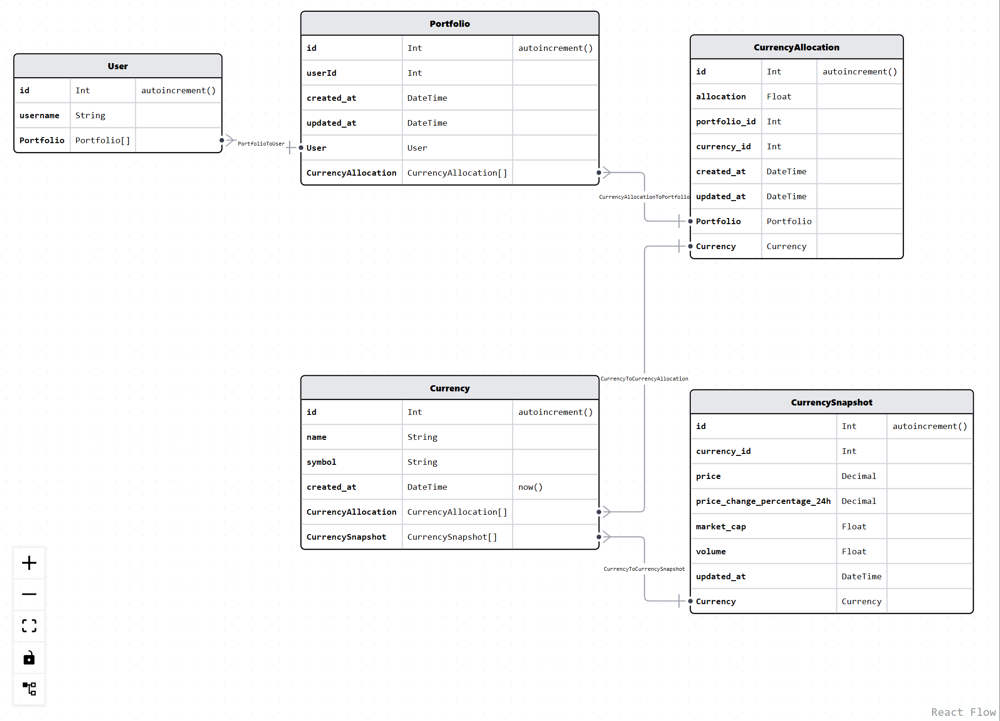

# Architecture

# Data Models

1. User
    - This table will store user information
2. Portfolio
    - This table will store portfolio information
    - Currently, it doesn't add much value, but allows for extensibility, such as allowing a user to create multiple portfolios
3. CurrencyAllocation
    - This table will store the cryptocurrencies associated with a particular portfolio
4. Currency
    - This table stores all available currencies in the system
    - This should be mostly static data (name, symbol, etc.)
5. CurrencySnapshot
    - This table stores market data for all currencies. 
    - It will contain one row for each currency
    - This table will be updated daily with the latest market data.

# Project Structure
- project/
    - Django App
    - REST API
    - Scheduled Celery task that pulls ctypto data from CoinGecko and syncs with database
- ui/
    - React App
- docker-compose.yml
    - Used for spinning up local resources for development
    - Redis (Celery Broker)
    - Celery Beat
    - Celery Worker
    - Postgres
- Dockerfile.celery
    - Dockerfile that defines the container for celery beat and worker processes to run in

# Crypto Data
Crypto market data gathered via coingecko's public API (https://api.coingecko.com/api)

# Improvements
1. Improve usage of serializers
2. Standardized exception handling / response messages
3. Client is not organized at all, focus was on django backend
    - State management is pretty sloppy, all just thrown into a single context with setters drilled down to components
4. AuthN/AuthZ

# How to run
1. clone the repo
2. cd into repo
3. run `pipenv install`
4. run `pipenv shell`
5. run `docker compose up -d`
6. cd into project/
7. run `python manage.py migrate` 
8. cd into ui/
9. run `npm install`
10. run `npm run dev`
11. site should be running at http://localhost:1234