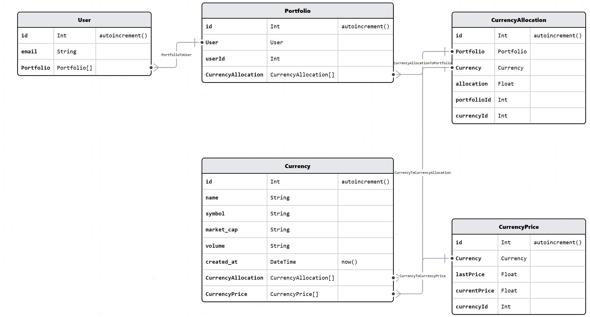

# Data Models

1. User
    - This table will store user information
2. Portfolio
    - This table will store portfolio information
    - Currently, it doesn't add much value, but allows for extensibility, such as allowing a user to create multiple portfolios
3. CurrencyAllocation
    - This table will store the cryptocurrencies associated with a particular portfolio
4. Currency
    - This table stores all available currencies in the system
5. CurrencyPrice
    - This table stores price data for all currencies. 
    - It will contain one row for each currency
    - This table will be updated daily with the latest market data.

# Project Structure
- 